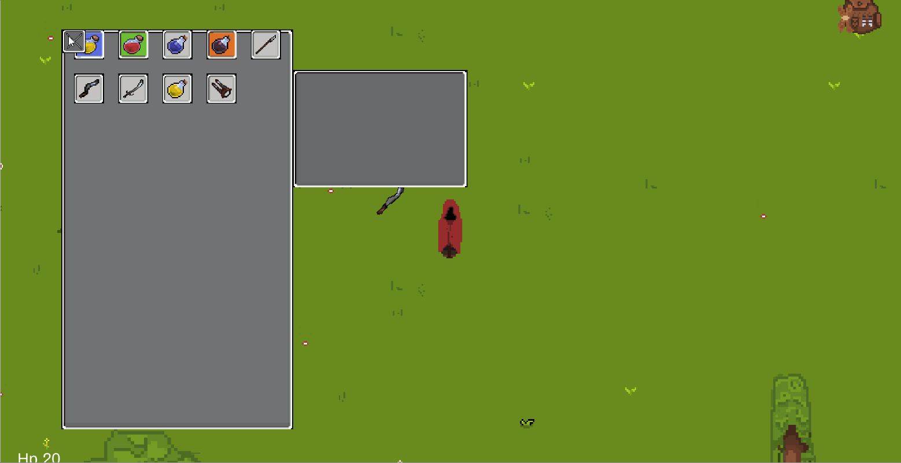

# Alchemist

This is my first project as a Unity developer, I tried to implement many mechanics and in the process of creating this game I learned the Unity engine.

___

## Development plan

- [ ] Core mechanics
  - [X] Movement
  - [ ] Battle
    - [X] Enemis
    - [ ] Boss fight
  - [X] Сombat system
  - [X] Inventory system
  - [X] Items 
  - [ ] Game art
  - [ ] Craft system
  - [ ] In game shop
- [ ] Side goals
  - [X] Advertising (test version)
  - [ ] Ui
    - [X] Main menu
    - [X] Pause menu
    - [ ] Shop menu
    - [ ] Craft menu
  - [ ] Audio
  - [ ] Particle system

  ## Short description

  In this game I use my own art, I do this for fun.
  

And more others.

___

Implemented here:
- Base movement 
  - [Movement](https://github.com/roki09/Alchemist/blob/main/Assets/Scripts/MainHero/HeroDirectionReader.cs) 
- Battle system 
  - [WeaponMoving](https://github.com/roki09/Alchemist/blob/main/Assets/Scripts/MainHero/Hands/HandsMoving.cs)
  - [Damage](https://github.com/roki09/Alchemist/blob/main/Assets/Scripts/Items/WeaponTrigger.cs)
  - [Enemis](https://github.com/roki09/Alchemist/blob/main/Assets/Scripts/Enemis/Enemis.cs)
    - [Slime](https://github.com/roki09/Alchemist/blob/main/Assets/Scripts/Enemis/Slime/SlimeBase.cs)
    - [BlueSlime](https://github.com/roki09/Alchemist/blob/main/Assets/Scripts/Enemis/Slime/BlueSlime.cs)
- Items system  
  - [InventorySystem](https://github.com/roki09/Alchemist/blob/main/Assets/Scripts/Items/InventoryHandler.cs)
    - [Chest](https://github.com/roki09/Alchemist/blob/main/Assets/Scripts/Items/ChestLogic.cs)
  - [Item](https://github.com/roki09/Alchemist/blob/main/Assets/Scripts/Items/Item.cs)
    - [Weapon](https://github.com/roki09/Alchemist/blob/main/Assets/Scripts/Items/Weapon.cs)
    - [ItemAnimation](https://github.com/roki09/Alchemist/blob/main/Assets/Scripts/Items/ItemAnimation.cs)
    - [ItemPickUp](https://github.com/roki09/Alchemist/blob/main/Assets/Scripts/Items/ItemPickUp.cs), [ItemDrop](https://github.com/roki09/Alchemist/blob/main/Assets/Scripts/Enemis/ItemDrop.cs)
    - [ItemShowStats](https://github.com/roki09/Alchemist/blob/main/Assets/Scripts/Items/ItemShowStats.cs)
    
**All items have rarity,and  are randomly generated in chests with different characteristics.**

- **Ui**
  - [MainMenu](https://github.com/roki09/Alchemist/blob/main/Assets/Scripts/Ui/MainMenuUI.cs)
  - [PauseMenu](https://github.com/roki09/Alchemist/blob/main/Assets/Scripts/Ui/PauseMenu.cs)
  - Advertising
    - [AdInitializer](https://github.com/roki09/Alchemist/blob/main/Assets/Scripts/Monetization/AdInitializer.cs)
    - [InterstitialAds](https://github.com/roki09/Alchemist/blob/main/Assets/Scripts/Monetization/InterstitialAds.cs)
  - [SaveSystem](https://github.com/roki09/Alchemist/blob/main/Assets/Scripts/Save/SaveLoad.cs)
    - [SaveManager](https://github.com/roki09/Alchemist/blob/main/Assets/Scripts/Save/SaveManager.cs)
    - [PlayerPrefs](https://github.com/roki09/Alchemist/blob/main/Assets/Scripts/Save/PlayerPrefsData.cs)

    ## More updates in the future
    - Boss fight
    - Craft
    - Shop
    - More items
    - Particle
    - Game statistic
    - And more others...

 
